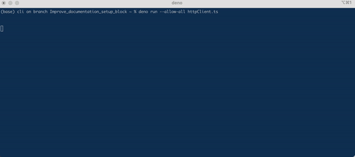

# Sapial
Semi-Autonomous Personal Intelligent Agent from Large language models

Sapial is a open framework for building personal agents that can be trained on your own data. It is built on top of [Deno](https://deno.land/), [Transforemrs](), [Langchain](), and [llama-index]().

Why Deno? 

## Architecture
Sapial is broadly divided into three parts:
1. Python backend services, exposed over local FastAPI bridge
2. Deno runtime (middleware), for running the agent
3. Client Interfaces, that connect to the Deno runtime via local HTTP API


## Setup
1. ### Install [Deno](https://deno.com/runtime) ###

&nbsp; &nbsp;  To check if you already have it installed, run 
```bash
deno --version
```

If Deno is installed, you should see a message like `deno 1.x.x` where `x.x` represents a version of deno

If you get `command not found` proceed with installation according to your OS
<details>
<summary>MacOS and Linux</summary>

Using Shell
```bash
curl -fsSL https://deno.land/x/install/install.sh | sh
```

or using [Homebrew](https://formulae.brew.sh/formula/deno)
```bash
brew install deno
```

</details>
<details>
<summary>Windows</summary>

Using [Scoop](https://scoop.sh/)

```bash
scoop install deno
```


or using [Chocolatey](https://chocolatey.org/packages/deno)
```bash
choco install deno 
```
</details>

2.  ## Install [Python](https://www.python.org/) and [Pip](https://pip.pypa.io/en/stable/installation/)
&nbsp; &nbsp;  To check if you already have it installed, run 
```bash
python --version
``` 

If Python is installed, you should see a message like `python 2.x.x` where `x.x` represents a version of Python

If you get `command not found` proceed with installation according to your OS

<details>
<summary>MacOS and Linux</summary>
</br>

Directly through [python](https://www.python.org/downloads/) website

or using [Homebrew](https://formulae.brew.sh/)
```bash
brew install python
```

</details>

<details>
<summary>Windows</summary>
</br>

Directly through [python](https://www.python.org/downloads/) website

or

Using [Scoop](https://scoop.sh/)

```bash
scoop install main/python
```

or 

Using [Chocolatey](https://chocolatey.org)
```bash
choco install python --pre 
```
</details>


### Important! ###
**In case you didn't have Python installed, make sure to restart your computer before proceesing to the next steps!**

&nbsp; &nbsp; Usually Pip is automatically installed with python

&nbsp; &nbsp;  To check if you already have it installed, run 
```bash
pip --version
``` 

If you get `command not found` proceed with installation according to your OS

<details>
<summary>MacOS and Linux</summary>
</br>

Using cli 
```bash
python -m ensurepip --upgrade
```

</details>

<details>
<summary>Windows</summary>
</br>


Using cli 

```bash
C:> py -m ensurepip --upgrade
```

</details>

4. ### Setup a Python [Virtual Environment](https://www.freecodecamp.org/news/how-to-setup-virtual-environments-in-python/) 

&nbsp; &nbsp; To setup the virtual environment, run this command in the terminal
```pip install virtualenv```

&nbsp; &nbsp; To use venv in your project, change directory into `services` by running
`cd services`

&nbsp; &nbsp;  and then run `python -m venv venv`

&nbsp; &nbsp;  This will create a vurtual environment inside `services` folder named `venv`

&nbsp; &nbsp;  run `cd ..` in your terminal to get back to the root folder


5. ### Install Python Dependencies 

&nbsp; &nbsp; To install, run `pip install -r ./services/requirements.txt` in your terminal

6. ### Setup your local environmental variables

&nbsp; &nbsp; In the root of directory, create a new file named `.env`

&nbsp; &nbsp; Open `.env` file using editor of your choice and add your OpenAI API key

&nbsp; &nbsp; Your `.env` file should look like this 
```bash 
OPENAI_API_KEY = "your_API_KEY" 
```


## Installation 

### Starting an agent 

&nbsp; &nbsp; To start an agent, run the following command in your terminal
```bash 
deno run --allow-all --unstable ./agents/alice.ts
```

&nbsp; &nbsp; In a separate terminal, start the CLI client by running

```bash
    cd /clients/cli
    deno run --allow-all httpClient.ts
```

&nbsp; &nbsp; To check if everything is working properly, type any prompt in the latter terminal




## Debug
Kill the fastAPI server on agent crash
lsof -i :8000 -> <PID>
kill -9 <PID>

## Next Steps Implementation
- add formatting to text
- start implementing basic agent architectures 
- add a retriever using llama-index
- tools and plugins

# Final Sharing
- share notes and repo with Andrew 

## Next Steps Planning
- define personas
- define personal alignment stratgies

## Later
- Refactor http server to be a class
- Add authentication for agents and clients using LibP2P
